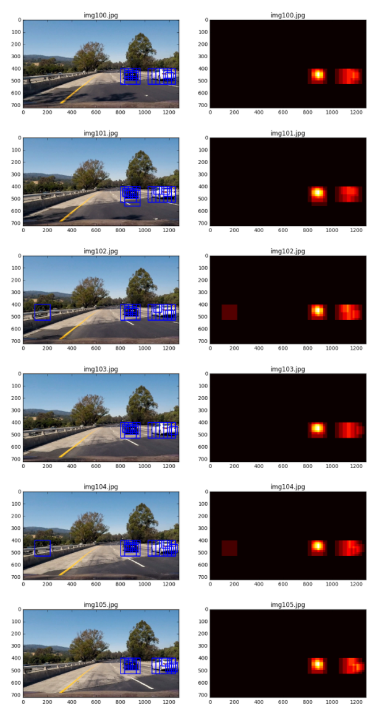

## Writeup
### 

---

**Vehicle Detection Project**

The goals / steps of this project are the following:

* Perform a Histogram of Oriented Gradients (HOG) feature extraction on a labeled training set of images and train a classifier Linear SVM classifier
* Optionally, you can also apply a color transform and append binned color features, as well as histograms of color, to your HOG feature vector. 
* Note: for those first two steps don't forget to normalize your features and randomize a selection for training and testing.
* Implement a sliding-window technique and use your trained classifier to search for vehicles in images.
* Run your pipeline on a video stream (start with the test_video.mp4 and later implement on full project_video.mp4) and create a heat map of recurring detections frame by frame to reject outliers and follow detected vehicles.
* Estimate a bounding box for vehicles detected.

[//]: # "Image References"
[image1]: ./examples/car_not_car.png
[image2]: ./examples/HOG_example.png
[image3]: ./examples/sliding_windows.png
[image4]: ./examples/sliding_window.png
[image5]: ./examples/bboxes_and_heat.png
[image6]: ./examples/labels_map.png
[image7]: ./examples/output_bboxes.png
[video1]: ./project_video.mp4

## [Rubric](https://review.udacity.com/#!/rubrics/513/view) Points
### Here I will consider the rubric points individually and describe how I addressed each point in my implementation.

---
### Writeup / README

#### 1. Provide a Writeup / README that includes all the rubric points and how you addressed each one.  You can submit your writeup as markdown or pdf.  [Here](https://github.com/udacity/CarND-Vehicle-Detection/blob/master/writeup_template.md) is a template writeup for this project you can use as a guide and a starting point.

You're reading it!

### Histogram of Oriented Gradients (HOG)

#### 1. Explain how (and identify where in your code) you extracted HOG features from the training images.

The code for this step is contained in the first code cell of the IPython notebook (or in lines # through # of the file called `some_file.py`).

I started by reading in all the `vehicle` and `non-vehicle` images.  Here is an example of one of each of the `vehicle` and `non-vehicle` classes:

I then explored different color spaces and different `skimage.hog()` parameters (`orientations`, `pixels_per_cell`, and `cells_per_block`).  I picked up an image of car and test it with `skimage.hog()`. I also tuned the parameters for the better results.

Here is an example using the `RGB` color space and HOG parameters of `orientations=9`, `pixels_per_cell=(8, 8)` and `cells_per_block=(2, 2)`:

#### 2. Explain how you settled on your final choice of HOG parameters.

I tried various combinations of parameters, and find out that the following parameters work better: `color_space = 'YCrCb'`, `orient = 11`, `pix_per_cell = 8`, `cell_per_block = 2`, `hog_channel = "ALL"`, `spatital_size (16,16)`, `hist_bins = 32`, `spatial = True`, `hog_feat = True`, `y_start_stop = [400, 656]`,`scale=1.5`. One princeple of choosing parameters is that I need as much infomation as possible for classifier that I will use to gain a more robust model, and I also need to crop the image before using `skimage.hog()` since cars are not likely to flying in the mid air.

#### 3. Describe how (and identify where in your code) you trained a classifier using your selected HOG features (and color features if you used them).

I trained a linear SVM using `sklearn.svm.LinearSVC()`. Before I started training, I split the dataset into traing set and test set, and I extracted features fro training set for training the model. Here's the learning curve of my model.

### Sliding Window Search

#### 1. Describe how (and identify where in your code) you implemented a sliding window search.  How did you decide what scales to search and how much to overlap windows?

I using the sliding window algorithm that was implemented in the same way to one presented in Udacity's lectures. It uses a fixed size window to iterate the whole ROI(usually the half buttom of the image) to detect if the fixed region contains a car.

But the first version of the algorithm is far from satisfaction.

#### 2. Show some examples of test images to demonstrate how your pipeline is working.  What did you do to optimize the performance of your classifier?

Ultimately I searched on two scales using YCrCb 3-channel HOG features plus spatially binned color and histograms of color in the feature vector, which provided a nice result.  Here are some example images:

 
---

### Video Implementation

#### 1. Provide a link to your final video output.  Your pipeline should perform reasonably well on the entire project video (somewhat wobbly or unstable bounding boxes are ok as long as you are identifying the vehicles most of the time with minimal false positives.)
Here's a [link to my video result](https://github.com/Meirtz/CarND-Vehicle-Detection/blob/master/processed_project_video.mp4) (The video is on my github)

#### 2. Describe how (and identify where in your code) you implemented some kind of filter for false positives and some method for combining overlapping bounding boxes.

I recorded the positions of positive detections in each frame of the video.  From the positive detections I created a heatmap and then thresholded that map to identify vehicle positions.  I then used `scipy.ndimage.measurements.label()` to identify individual blobs in the heatmap.  I then assumed each blob corresponded to a vehicle.  I constructed bounding boxes to cover the area of each blob detected.

Here's an example result showing the heatmap from a series of frames of video, the result of `scipy.ndimage.measurements.label()` and the bounding boxes then overlaid on the last frame of video:

### Here are six frames and their corresponding heatmaps:

### After all, I combine my result of P4:Advance finding lane line. Here the resulting bounding boxes are drawn onto the last frame in the series with other metadata:

---

### Discussion

#### 1. Briefly discuss any problems / issues you faced in your implementation of this project.  Where will your pipeline likely fail?  What could you do to make it more robust?

The problem I faced was the parameters are always hrad to tune. I like the parameters tuning progress in deep learning since I can feel some hide patterns of tuning them somehow although I can't tell extactly what they are. I think the ultimate way to make them robust and easy to code is to using deep learning such as YOLO2, Mask_RCNN asn so.

